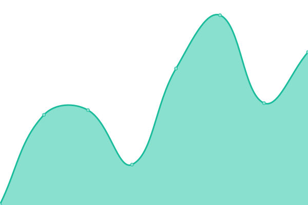
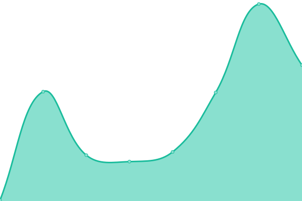

# [📈 Live Status](https://Ompro23.github.io/uptime-status): <!--live status--> **🟧 Partial outage**

This repository contains the open-source uptime monitor and status page for [Ompro23](https://Ompro23.github.io/uptime-status), powered by [Upptime](https://github.com/upptime/upptime).

With [Upptime](https://upptime.js.org), you can get your own unlimited and free uptime monitor and status page, powered entirely by a GitHub repository. We use [Issues](https://github.com/Ompro23/uptime-status/issues) as incident reports, [Actions](https://github.com/Ompro23/uptime-status/actions) as uptime monitors, and [Pages](https://Ompro23.github.io/uptime-status) for the status page.

<!--start: status pages-->
<!-- This summary is generated by Upptime (https://github.com/upptime/upptime) -->
<!-- Do not edit this manually, your changes will be overwritten -->
<!-- prettier-ignore -->
| URL | Status | History | Response Time | Uptime |
| --- | ------ | ------- | ------------- | ------ |
|  [Portfolio](https://ompro23.github.io/portfolio) | 🟩 Up | [portfolio.yml](https://github.com/Ompro23/uptime-status/commits/HEAD/history/portfolio.yml) | 

 119ms
     
 | 

<a href="https://Ompro23.github.io/uptime-status/history/portfolio">100.00%</a>
    

|  [Casaos](https://kijfq97p2k80.share.zrok.io/) | 🟥 Down | [casaos.yml](https://github.com/Ompro23/uptime-status/commits/HEAD/history/casaos.yml) | 

 531ms
     
 | 

<a href="https://Ompro23.github.io/uptime-status/history/casaos">7.00%</a>
    

|  [Gitea](https://q5tk1s2laal7.share.zrok.io/) | 🟥 Down | [gitea.yml](https://github.com/Ompro23/uptime-status/commits/HEAD/history/gitea.yml) | 

 547ms
     
 | 

<a href="https://Ompro23.github.io/uptime-status/history/gitea">10.29%</a>
    

|  [PVM](https://supposedly-stirred-sawfish.ngrok-free.app/) | 🟥 Down | [pvm.yml](https://github.com/Ompro23/uptime-status/commits/HEAD/history/pvm.yml) | 

 234ms
     
 | 

<a href="https://Ompro23.github.io/uptime-status/history/pvm">5.42%</a>
    

|  [TestPort](https://ompro23.github.io/testport/) | 🟩 Up | [test-port.yml](https://github.com/Ompro23/uptime-status/commits/HEAD/history/test-port.yml) | 

 30ms
     
 | 

<a href="https://Ompro23.github.io/uptime-status/history/test-port">100.00%</a>
    

|  [MirrAR](https://mirr-ar-mauve.vercel.app/) | 🟩 Up | [mirr-ar.yml](https://github.com/Ompro23/uptime-status/commits/HEAD/history/mirr-ar.yml) | 

 173ms
     
 | 

<a href="https://Ompro23.github.io/uptime-status/history/mirr-ar">100.00%</a>
    

<!--end: status pages-->

[**Visit our status website →**](https://Ompro23.github.io/uptime-status)

## 📄 License

- Powered by: [Upptime](https://github.com/upptime/upptime)
- Code: [MIT](./LICENSE) © [Anand Chowdhary](https://anandchowdhary.com), supported by [Pabio](https://pabio.com)
- Data in the `./history` directory: [Open Database License](https://opendatacommons.org/licenses/odbl/1-0/)
